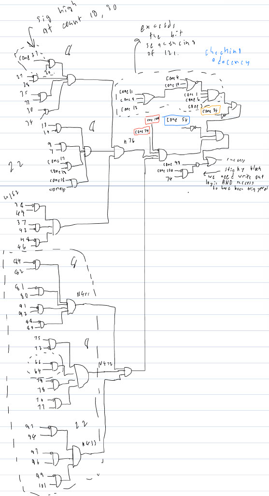
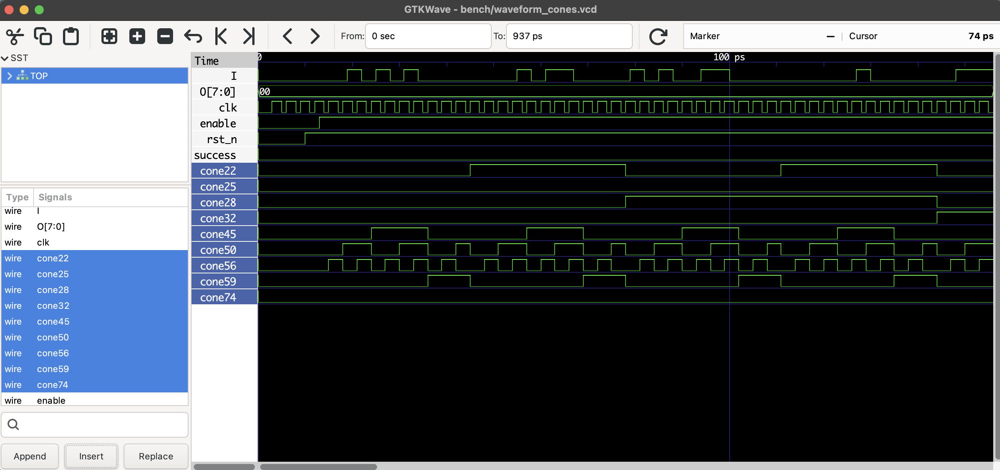
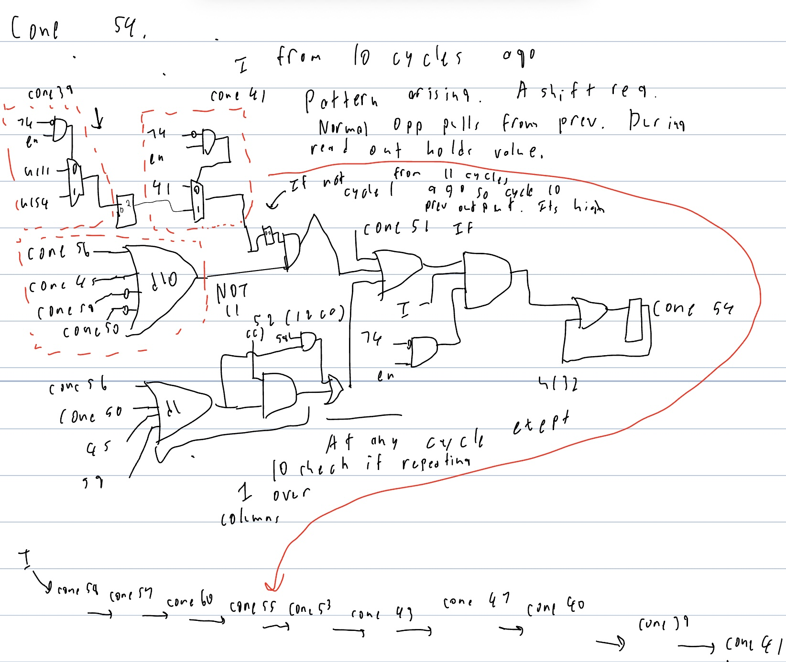
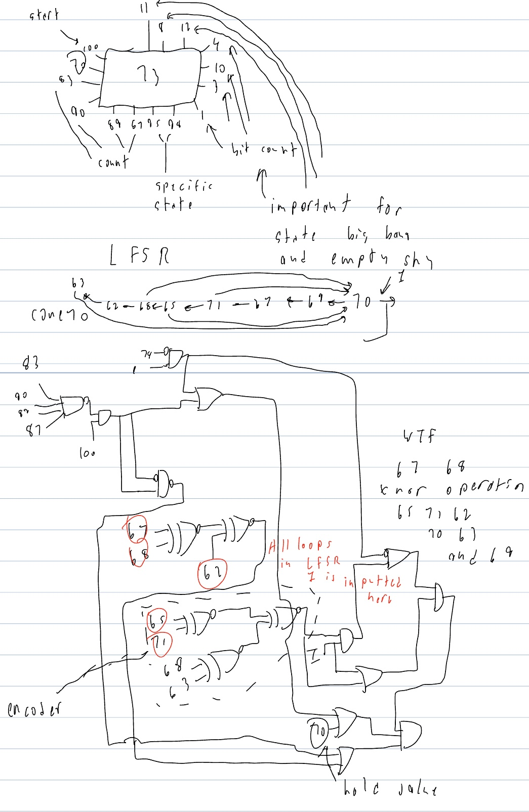
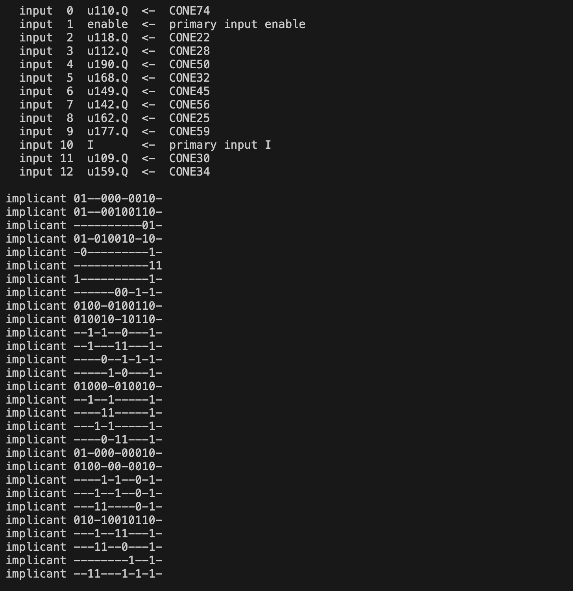
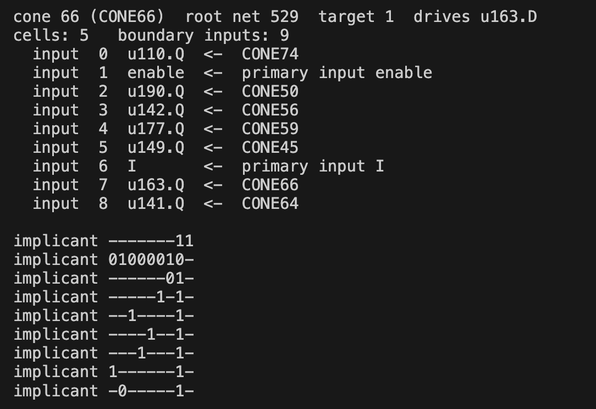

# Approach to solution
My raw notes for this puzzle:  //ADD PDF HERE

For this puzzle I used a combination of two analysis to solve the puzzle. By solving the puzzle I mean finding the correct 121 bit signal required but ALSO understanding how the circuit functions at a logic gate level. First I will go through the GDS parsing (link to topic on that) then the circuit analysis I did from mostly step 5 of the GDS parser,under the Cones, then finally using Z3 to understand the data path combinational blocks aswell as looking into what 121 bit signal sets the success signal high. IMPORTANT Note: I want this writeup to focus much more on the circuit analysis and less on the scripting as although it was what provided the solution that involved using external complex computing algorithms and a lot of Claude Code. The scripts helped me make some jumps in the circuit analysis that would have taken significantly longer if I was only doing the circuit analysis.

## GDS Parsing

From a broad stand point the GDS parsing was a 5 stage process starting from the .gds file to a formatted GDS file to a graph of all cells to a graph of logical cells connected(netlist) to a graph of nodes of combinational blocks and edges being D-flip flops. For this task I used a lot of vibe coding but kept this pipeline as the underlying idea.

### Python Scripts from GDS to winning solution
#### [GDS file to netlist graph](src/klayoutNetlist.py)
The first file to look into is klayoutNetlist. This really does the first 3 steps of the pipeline described above taking a gds file as an input and a netlist as an output. To simplify this step as much as possible I asked Claude to also use the Klayout tool for this task. What this provided was some readable file in return that the python file organizes into formatted information. The information important are instances of cells, this is a graph of sky130 logic cells as nodes and connections between each as edges. So this step allowed us to take a GDS file which does not have a user readable format and turn it into a data structure that is very easy to walk through and understand for later algorithms created.

#### netlist to combinational blocks
So now there is a Netlist Graph, the issue with a netlist graph is the size and organization; the amount of cells is too large to say draw out and if you tried making specific larger blocks from this step you would have to think of some algorithm that says there is a limit to how many logic cells I will search around me before I am just making the entire circuit in this clock. Instead for organization we can just seperate the chips design into every combinational block between two flip flops. What this gives us is an organized set of every computational step in this circuit AND a very definitive approach of achieving this organized set, all you are doing is walking some graph to see all cells between a data input pin of a flip-flop to the output of another flip-flop or a direct input of circuit. For this step I used [coneDecompose.py](src/coneDecompose.py) which as stated before just starts walking back from every sequential element to the FF outputs and chip inputs to provide the fan-in of the cone.

#### Json files to Verilog
With two data structures containing the recovered gds file the next step is turning these into verilog files to test if the algorithms Claude created actually worked. This is when [coneToVerilog.py](bench/conesToVerilog.py) and [netlistVerilog.py](bench/netlistVerilog.py) are used. All it is doing is parsing a json file and does it in two main functions cleaning the json file into only specific information the parser needs and then declaring ports which provided the name and direction of each port.

 Now that I had a netlist and cones file to verify functionality I made tb_cones.cpp and tb_netlist.cpp. I used a semi-UVM type of testbench made in C++ to test functionality. The hardest part of the testbenches was finding an effecient way to get the waves data from example inputs into the C++ file or just into some formatt I could adjust easily to test, I had Claude create vcd parsing files and then at some point just had it put the characters directly in cpp file so I could easly adjust. After some verification from the testbenches we now had working verilog files to do the circuit analysis.

## Circuit Analysis

For the circuit analysis I started by looking into the most complex cone. From looking at the verilog file CONE98 is the one to look into. It drives the success output which is the function of circuit along with the output drivers. From here I drew out this cone as you can see below. When looking into this cone I started by examing the cones based on how much of an influence they have on driving success. 

### Control 
The first place this analysis took me was cone74 which is a pin present in almost every pin. Now its role in every pin as a pair to the enable pin, meaning cones are not enabled when CONE74 is high which occurs when the ASCII readout is happening. First thought when seeing the waveform is CONE74 is the DONE state of state machine. So if this is the state machine I should see how the pins connected to it operate. After doing more analysis by drawing out the cones in (my notes)[] and viewing waveforms I had the description of all state machine inputs which were simply different modulo counters ranging from modulo-1 which just index on the rising edge of the clock to modulo 44 for cone 32. The key things to pick up from the wave analysis I show below are the sequences like cone 45 and 59 which don't follow standard modulo but rather repeat every 11 clock cycles. This piece of evidence tells us the control is checking something and the fact it has checkers repeating every 11 clock cycles and its a 121 clock sequence hint towards the 11x11 grid that is the final solution.

### Bit counting
So just from looking at cone 74 I found the functions of 10 cones. The next two areas I were cone54 and the combinational block right beside cone 54 in the success cone. So cone 54 is a large combinational cone control inputs stated above along with inputs from cone 52, 58 and 41. When you look into those 3 cones they are a shift register of every I input for the last 12 inputs. The exact is structure is page 6 of the notes but boils down to two control gates that go low at counts 1 and 11 of every signal and three of inputs from the register from I 1, 10, 11 and 12 clock cycles ago. We also know this is sticky cone and it must stay low to trigger success. After looking at the waveform with knowing the circuit and providing some sample inputs we can see that this is test adjacency. The reason for the two control gates that go low att 11 and 1 was for a wrap around from bit 11 of one sequence to bit one of the next, this should not set a flag. It is testing if two ones are ever diagonal or touching and if so success will not trigger. This is the first major hint into how to trigger success. The next analysis went into the cones directly beside it; cones 24, 1, 6, 3, 4 and 10. Cone 24 which holds the most signifcance was a very simple circuit. When you derive circuit 26 and 31 you see that this is just counting two high bits and resets at count 11, simple as that but gives us another massive clue to find the solution. After seeing how cones 24,26 and 31 responsed to inputs I moved analysis much more to checking waveforms. This gave me information on all other cones in that combinational block and descriptions are in the notes. Summary is each cones represents a count of high signals and only a specific bit count turns this signal high being 22. So from this information we have found that there is a specific 22 bits, two high bits per 11 total bits and they cannot be adjacent in any direction. That already gives you a lot of information of how the bit stream that drives success high will work.

### Bit Checking with Control
So from just analyzing 36 of the 99 cones in the ASIC I know there are 22 ones in the solution two per row where a row is 11 bits and the 1's can never touch if we imagine a 11x11 grid setup. Looking at what's left of the cone 98 structure it is pretty obvious to know the sea of AND gates probably links to sticky registers that go high when a specific part of the sequence happens. Now there are two approachs I took with trying to understand these but a major disclaimer I want to note is that by this point I already knew the solution and making some of these leaps having zero clue what the solution looks like is much harder and not what I did, this is purely trying to understand how the circuit funcitions. Now the first idea you could use to derive this is knowing how the cones react to I. I will use an example for this: We want to know what triggers cone 30 to be low and cone 34 to be high. First step is a 121-bit signal of all 1's this tells us how the cone reacts to these ones, will it do nothing, with it oscilate or in our case cone 30 will go high at some specific moment and then drop right after. So we already know what cone 30 needs to go high but want 30 low and 34 high which we are going to assume happens because of 30 already being high. So we erase all 1's before the 1 that triggers 30 and then have a zero after for and every signal below for adjanency and try again. We see the cone 30 goes low at the next 1 in the same column. So that tells us it 30 is triggered by 1's in column 1 and from some other investivation we know it can trigger in any of the next columns(**). Now that example I gave does have a lot of advantages because I have already found a valid sequence for success but taking those debugging steps is possible and is how I was able to decode what the cones do. The cone analysis however changed for this. I used a tool with Z3 to provide all possible signals that can drive a cone to 0 or 1. I wanted to mention this for this step because it is another approach you could use to decode these blocks and does require lots of large jumps like I took with the example knowing there is going to be 1 bit after the bit that triggers cone 30 to trigger cone 34 and untrigger 30. This just requires knowing the bit count and control logic. If you put cone 34, the cone we want high from the previous example, into this python file it will output all possible combinations. Now it would be nice if it output one 11 bit sequence that worked but instead there are several that work but for our knowledge of how the signals around work you can narrow it down pretty quick. One of which is that cone 30 must be high and I must be high so the next place to look is how cone 34 gets high. This actually has a more decisive logic block but still has lots of combinations the one thing to look at however is a specific combination. So I chose one where cone 25 was high and cone 50 aswell but every other clock was low. These are control blocks based souly on timing so what this combination is giving me is a specific time point where if I is high then cone 34 will go high. If you use this combination with the test bench you take your already narrow option of inputs and can narrow it down. Now I won't go too much into detail because I have spent a long time talking about the underlying mechanics of the circuit but if you test this for every group of two cones you see in the original schematic you get the pairs of mostly coloums checking if both bits are present but there are 6 cones; 93,94,96,97,99 and 101 where this doesn't happen and instead for example it will check the 1 bit in column 6 of row 2 and then go to bit columns 5 of row 7 it still checks all bits but does the check in an odd way. The lower group of cones check bits just by column in the standard way. 22 cones deticated a change in how 3 columns of bits are checked which I think is complexity of the ASIC I just never got to.
(**) IMPORTANT: This description of cone 30 is wrong it functions differentely what this example explains is cone 66 and 64 where it will only be triggered by the specific 1's in the correct column and row.

### Output buffers
So by this point about 80 cones full function has been discovered specifically all cones that had some sort of direct wiring in the success block. What's left? the output generator, probably the most complicated part of the circuit because how this occurs isn't as clear as the Bit checking with control or success block. So where I start with this was cones that feed into the output block, start with as little logic as possible this explained cones. What we have as inputs are really four main things; a 4-bit incrementing clock, the counter for how many 1's, cone to success and symettric fan-in cone to it, cone 100 which is signal to start write out and lastly cone 70. Cone 70 is a LFSR for every new input. My derivation for this was mostly based on the blocks around and the randomness you see. It is a combinational clock with the 4-bit clock yet it runs through the operation and it has chains of xnor gates. The XNOR are the key thing and if you follow the blocks its connected to you see they all also have chains of XNOR gates yet 70 is the only block with an I input. The verdict I have come to is there is some encoding scheme going on in the output block to hide revealing the messages that can get outputted. The one confusing bit is if they are only encoding the success output and not the other 4. I didn't have time to draw out the output block to answer this question.

## Using Z3 for larger blocks
Now when I first started this puzzle I really wanted to do it more the vibe coding, I have a hardware background so I don't code a lot in python and especially not before I could get Claude to do it. So my original plan was to just find the puzzles solution through scripts and not think too deeply about how the circuit works. So my first attempt at solving this puzzle used an external SMT solver which I learned about while trying this project. The solution can be done by just asking Claude to create a z3 program that will unroll the sequential circuit treat every input as a bit-vector and see what bit-vector drivers the output (success) high. I really hated this scripting solution which is why I am spending so little time talking about it but that was my first approach to finding the bit sequence. As the report shows I was able to recover it without needing this scripting file and just pen and paper but that is my software solution. What I actually found more interesting when using this external program z3 was using it as a tool to just understand the larger combinational blocks. I implemented a tool that would take just an input of a specific cone and if you wanted it high or low (python3 src/decomposeCone.py CONE70 1) for example and this would output all bit-vectors of the input that drove the signal to high or low. I highlight how useful this exact tool was in reverse engineering cones 7,9,13,14,15,17,18,19,20,23,27,28,30,33,34 and 35 in the Easter Egg I missed.

## Easter Egg I missed
I wanted to add an additional section on a correction from my previous write up. In "bit checking with control" I gave an example of decoding cone 30 which is actually wrong as I wrote at the bottom. There was two things about the top group of cones in cone 98 that made me revisit the problem. Why did high signals around the specific point where it should go high also trigger the system of two cones. This checker is searching for a specific combination of 121 bits. Secondly, why right below it was there a structure that did the exact same thing but correctly. So I threw two cones into my z3 decomposeCone tool the image of the output is shown below and theres something very obvious. That middle section of bits is all control bits. For cone 66 the first example there is only one point in time, shown by the control bit, when that signal can be high. For cone 30 there are 4 distinct times it can be high. So I had to find out where these possible points were. Did they just represent things like what triggered cone 95? Or was it pattern? I will show an example of how you can see which points on the 11x11 grid a 1 causes a high signal. This is a table deriving which 1's trigger cone 27(chosen because it is the smallest). The conclusion on the right now make a lot more sense when you see all the control bit and once those are specified only specific cycles are left. To see all the derivations you can see pages 17 and 18 of my notes during this puzzle.

| 74 | en | 22 | 28 | 32 | 45 | 50| 56| 25| 59| I | 27| 29|                     |
|----|----|--- |----|----|----|---|---|---|---|---|---|---|---------------------|
| 0  | 1  | 0  |  - |  0 | 1  | 1 | 1 | 0 | 0 | 1 | 0 | - |col 8 cyc 0-11,22-33 |
| 0  | 1  | 0  |  - |  0 | 1  | 1 | 1 | 0 | 0 | 1 | 0 | - |col 9 cyc 22-44      |
| 0  | 1  | 0  |  - |  0 | 1  | 1 | 1 | 0 | 0 | 1 | 0 | - |col 7-8 cyc 22-33    |
| 0  | 1  | 0  |  - |  0 | 1  | 1 | 1 | 0 | 0 | 1 | 0 | - |col 10 cyc 33-44     |

<table>
  <tr>
    <td></td>
    <td></td>
  </tr>
</table>

## Final Thoughts
This is the second Jane Street Puzzle I have done and I absolutely loved it. Circuit design and circuit deriving are a really fun task and what I loved about this was the amount of unexpected turns the puzzle had. My two favourite were the LSFR in cone 70 and of course the Easter Egg I missed. I really love the fact Jane Street produces these puzzles for the public to do as they let me practice my hardware engineering in a really fun way. After doing the AoC in Hardcaml in January I looked at the Github of Anish Singhani and if he himself reading this ReadMe I would love it if he could reach out and provide and tips on my very old fashioned brute force approach with this puzzle or any new development tools in the FPGA/ASIC development space. If anyone else finds themselves reading this repo and has any questions or comments please reach out @ max.zischka1@gmail.com or connect with me on [LinkedIn](https://www.linkedin.com/in/max-zischka/).

## Usage of AI
As I stated throughout this Readme and as you can see in the Claude README I limited the LLM's abilities to just writing scripts for some tools it never interacted with any of the puzzle files EXCEPT for one exception which was simply to put all waveform_example file inputs and outputs into a string in my testbench absolutely no information about the puzzle or ways to solve was given. I really dislike WHEN I decided to try and reverse engineer using circuit analysis as it was after I had implemented symSolve.py which really wasn't a rewarding solution and didn't even answer half the question this puzzle was asking which was how the circuit actually functions. I linked my raw notes at the top as just a small indicator into the work I did not taking the shortcut of putting the gds file into Claude where I am sure it could have recovered most of the same information I was able to find.